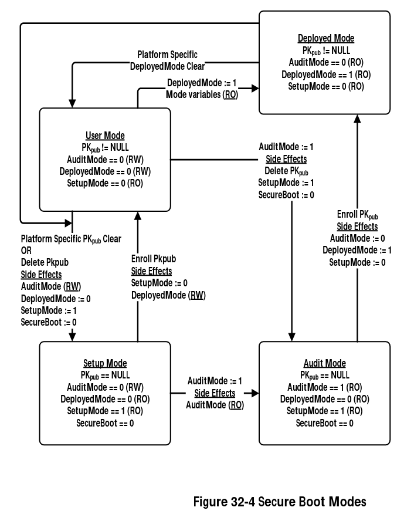

# Secure Boot

> The UEFI [...] specification [...] defines a protocol known as Secure Boot, which can secure the boot process by preventing the loading of UEFI drivers or OS boot loaders that are not [signed](https://en.wikipedia.org/wiki/Public-key_cryptography) with an acceptable [digital signature](https://en.wikipedia.org/wiki/Digital_signature).

*Source: [Wikipedia](https://en.wikipedia.org/w/index.php?title=Unified_Extensible_Firmware_Interface&oldid=1040078282#Secure_Boot)*

## Secure Boot keys

The full explanation can be found in [The Meaning of all the UEFI Keys](https://blog.hansenpartnership.com/the-meaning-of-all-the-uefi-keys/).

**Platform Key (PK)**

> The Platform Key is the key to the platform and is stored in the `PK` variable.  Its job is to control access to the `PK` variable and the `KEK` variable.

**Key Exchange Key (KEK)**

> The Key Exchange Key is used to update the signature database and is stored in the `KEK` variable. It may be used either to update the current signature databases or to sign binaries for valid execution.

**Signature Database (db)**

> The signature database is used to validate signed efi binaries and loadable roms when the platform is operating in secure mode. It is stored in the `db` variable.  The `db` variable may contain a mixed set of keys, signatures or hashes.

**Forbidden Signature Database (dbx)**

> The forbidden signatures database is used to invalidate efi binaries and loadable roms when the platform is operating in secure mode.  It is stored in the `dbx` variable.  The `dbx` variable may contain either keys, signatures or hashes.

## Secure Boot modes

From the [UEFI Specification Version 2.9 (March 2021)](https://uefi.org/sites/default/files/resources/UEFI_Spec_2_9_2021_03_18.pdf) (page 1697 and 1698).

**Setup Mode**

> While no Platform Key is enrolled, the SetupMode variable shall be equal to 1. While SetupMode == 1, the platform firmware shall not require authentication in order to modify the Platform Key, Key Enrollment Key, OsRecoveryOrder, OsRecovery####, and image security databases.
>
> After the Platform Key is enrolled, the SetupMode variable shall be equal to 0. While SetupMode == 0, the platform firmware shall require authentication in order to modify the Platform Key, Key Enrollment Key, OsRecoveryOrder, OsRecovery####, and image security databases.
>
> While no Platform Key is enrolled, and while the variable AuditMode == 0, the platform is said to be operating in *setup* mode.

**User Mode**

> After the Platform Key is enrolled, and while the variable AuditMode == 0, the platform is operating in *user* mode. The platform will continue to operate in user mode until the Platform Key is cleared, or the system is transitioned to either Audit or Deployed Modes.

**Audit Mode**

> Audit Mode enables programmatic discovery of signature list combinations that successfully authenticate installed EFI images without the risk of rendering a system unbootable. Chosen signature lists configurations can be tested to ensure the system will continue to boot after the system is transitioned out of Audit Mode.

**Deployed Mode**

> Deployed Mode is the most secure mode. [...] By design, both User Mode and Audit Mode support unauthenticated transitions to Deployed Mode. However, to move from Deployed Mode to any other mode requires a secure platform-specific method, or deleting the PK, which is authenticated.

## Secure Boot key management

To limit the consequencese of a key compromise the Secure Boot keys are self-hosted, i.e. they are generated on the machine on first boot and stored on a encrypted partition.

## Chain of Trust

A chain of trust is needed to ensure the system hasn't been tampered with.

**Boot process (simplified)**

UEFI -> bootloader ([systemd-boot](https://www.freedesktop.org/software/systemd/man/systemd-boot.html)) -> [Unified Kernel Image](https://systemd.io/BOOT_LOADER_SPECIFICATION/#type-2-efi-unified-kernel-images) -> rootfs checked with [dm-verity](https://www.kernel.org/doc/html/latest/admin-guide/device-mapper/verity.html) -> userspace

1. UEFI checks the bootloader is signed with a valid signature
1. systemd-boot calls into UEFI ([`LoadImage()`](https://edk2-docs.gitbook.io/edk-ii-uefi-driver-writer-s-guide/5_uefi_services/readme.2/524_loadimage_and_startimage)) and UEFI checks the [Unified Kernel Image](https://systemd.io/BOOT_LOADER_SPECIFICATION/#type-2-efi-unified-kernel-images) is signed with a valid signature
1. The [Unified Kernel Image](https://systemd.io/BOOT_LOADER_SPECIFICATION/#type-2-efi-unified-kernel-images)'s initrd uses a hash and [dm-verity](https://www.kernel.org/doc/html/latest/admin-guide/device-mapper/verity.html) to ensure the rootfs hasn't been tampered with
